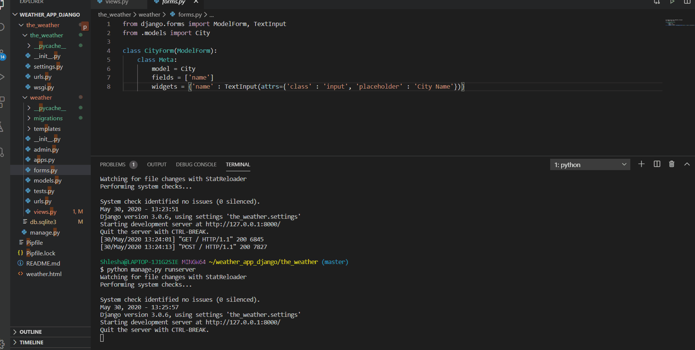

## Weather Application using Django
I have created a weather app in Django that gets the current weathers for multiple cities. To do this, I used Python Requests to call the Open Weather Map API.

### API link
https://openweathermap.org/api

### Demo

